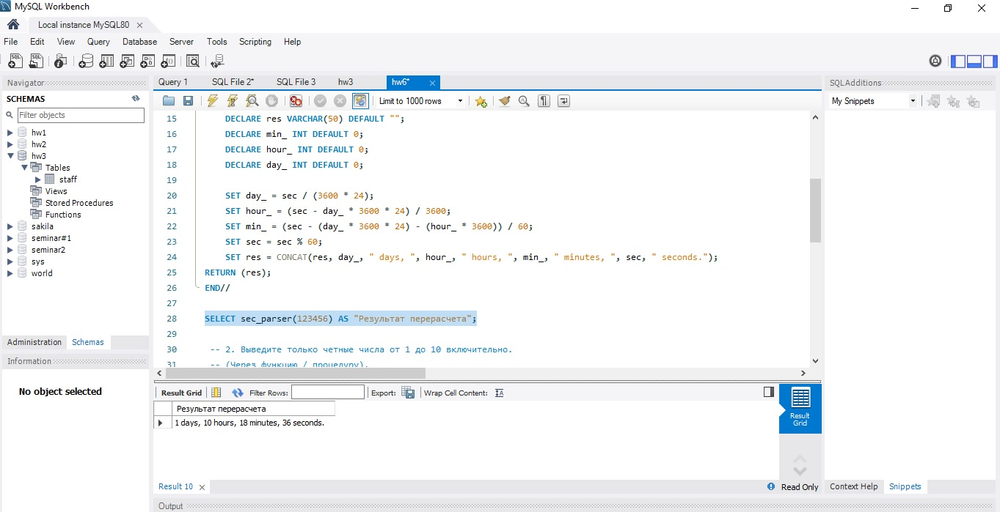
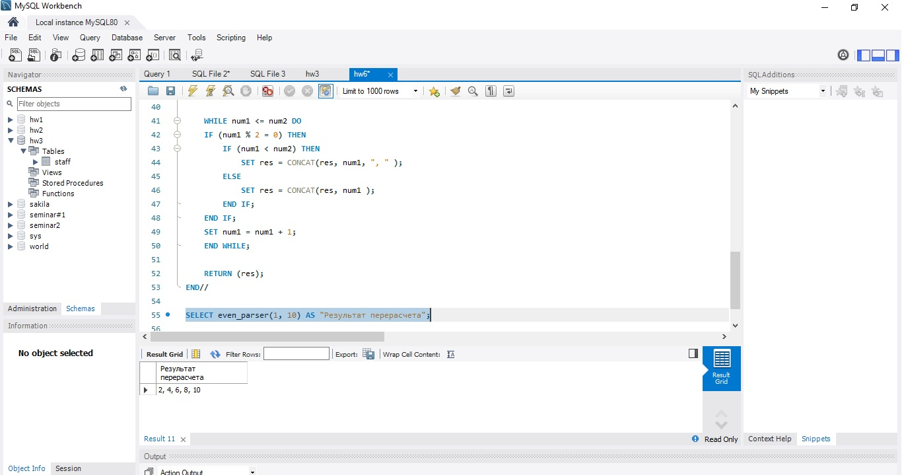

## 1. Создайте функцию, которая принимает количество секунд и форматирует их в количество дней,
## часов, минут и секунд.
## Пример, 123456 -> '1 день, 10 часов, 17 минут, 36 секунд'.
 
DROP DATABASE IF EXISTS hw6;\
CREATE DATABASE IF NOT EXISTS hw6;\
USE hw6;

DELIMITER // \
CREATE FUNCTION sec_parser(sec INT )\
RETURNS VARCHAR (50)\
DETERMINISTIC\
BEGIN\
	DECLARE res VARCHAR(50) DEFAULT "";\
    DECLARE min_ INT DEFAULT 0;\
    DECLARE hour_ INT DEFAULT 0;\
    DECLARE day_ INT DEFAULT 0;
    
    SET day_ = sec / (3600 * 24);\
    SET hour_ = (sec - day_ * 3600 * 24) / 3600;\
    SET min_ = (sec - (day_ * 3600 * 24) - (hour_ * 3600)) / 60;\
    SET sec = sec % 60;\
    SET res = CONCAT(res, day_, " days, ", hour_, " hours, ", min_, " minutes, ", sec, " seconds.");\
RETURN (res);\
END//

SELECT sec_parser(123456) AS "Результат перерасчета";

## 2. Выведите только четные числа от 1 до 10 включительно. 
## (Через функцию / процедуру).
## Пример: 2,4,6,8,10 (можно сделать через шаг + 2: х = 2, х+=2).
    
DELIMITER // \
CREATE FUNCTION even_parser(num1 INT, num2 INT )\
RETURNS VARCHAR (50)\
DETERMINISTIC\
BEGIN\
	DECLARE res VARCHAR(50) DEFAULT "";
    
    WHILE num1 <= num2 DO\
    IF (num1 % 2 = 0) THEN\
		IF (num1 < num2) THEN\
			SET res = CONCAT(res, num1, ", " );\
		ELSE\
			SET res = CONCAT(res, num1 );\
		END IF;\
	END IF;\
    SET num1 = num1 + 1;\
    END WHILE;
    
    RETURN (res);\
END// 

SELECT even_parser(1, 10) AS "Результат перерасчета";

